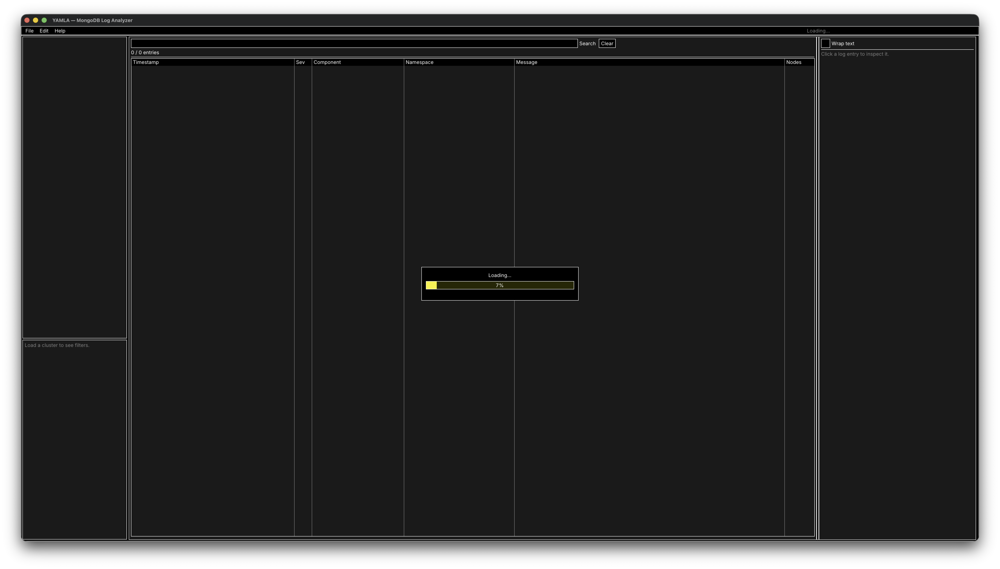
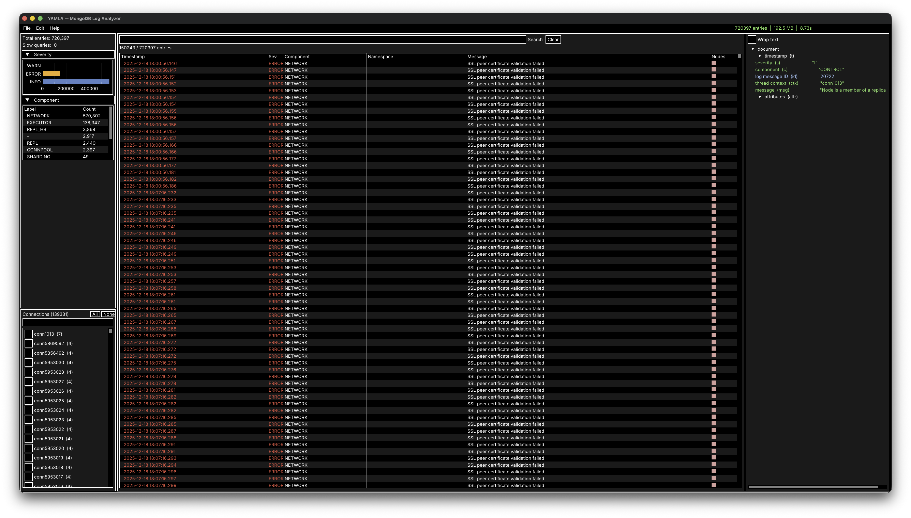
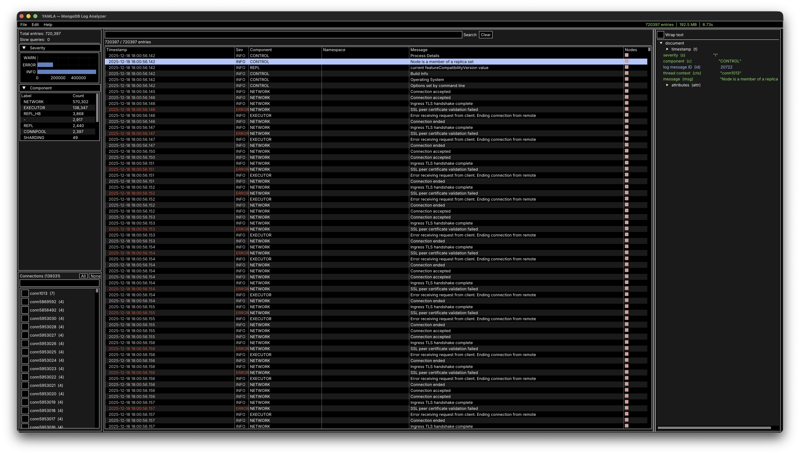

# YAMLA

Yet Another MongoDB Log Analyzer. Fast, terminal-aesthetic desktop GUI for
inspecting and filtering MongoDB 4.4+ structured JSON logs.

> **Supported log type:** `mongod` server logs only.
> YAMLA does not currently support MongoDB Agent logs, Ops Manager logs,
> `mongos` router logs, or FTDC diagnostic data files.

## Screenshots

**Start screen**


**Loading progress**


**Post-load overview — breakdown panels, log list, filter panel**


**Severity filter active — bar chart highlight and filtered log list**


**Detail view — log entry inspected as a formatted JSON tree**


## Dependencies

| Tool | Notes |
|------|-------|
| clang++ | C++17 |
| Homebrew SDL2 | `brew install sdl2` |
| pkg-config | `brew install pkg-config` |
| Conan 2 | `pip3 install conan` |
| Python 3 | For Conan |

## Build

**One-time setup** — install Conan deps (imgui, implot, simdjson):

```sh
conan profile detect --force
make deps
```

**Compile:**

```sh
make
```

Binary is written to `./yamla`.

## Run

```sh
make run
# or
./yamla
```

The app starts maximised. Drag one or more MongoDB log files onto the window
to load them. Multiple files are treated as a single replica-set cluster and
merged by timestamp.

## Fonts

Four fonts ship in `vendor/fonts/` (all OFL-licensed):
Inter, IBM Plex Sans, Fira Code, JetBrains Mono.

To re-download them:

```sh
make fonts
```

Font and size are changed via **Edit → Preferences…** and persist to
`~/.config/yamla/prefs.json`.

## Features

- Virtual-scroll log list — handles millions of entries without lag
- Click any row to inspect the full entry as a collapsible JSON tree
- Breakdown bar charts and tables: severity, op type, component, driver,
  namespace, query shape
- Connection ID and driver type filter panel with checkboxes
- Text search, category filters, cross-filter wiring
- Resizable detail panel (drag the splitter); word-wrap toggle
- Multi-node cluster support with per-node colour badges

## MongoDB log format

Requires MongoDB 4.4+ structured JSON log format (one JSON object per line).
Legacy text logs are not supported.
